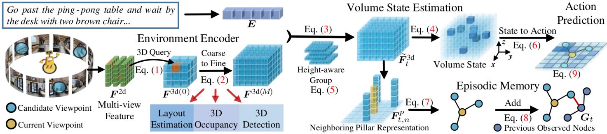

# Volumetric Environment Representation for Vision-Language Navigation

> This repository is an official PyTorch implementation of paper: 
> [Volumetric Environment Representation for Vision-Language Navigation](https://arxiv.org/abs/2403.14158). 
> CVPR 2024. ([arXiv 2403.14158](https://arxiv.org/abs/2403.14158))

## Abstract
Vision-language navigation (VLN) requires an agent to navigate through an 3D environment based on visual observations and natural language instructions. It is clear that the pivotal factor for successful navigation lies in the comprehensive scene understanding. Previous VLN agents employ monocular frameworks to extract 2D features of perspective views directly. Though straightforward, they struggle for capturing 3D geometry and semantics, leading to a partial and incomplete environment representation. To achieve a comprehensive 3D representation with fine-grained details, we introduce a Volumetric Environment Representation (VER), which voxelizes the physical world into structured 3D cells. For each cell, VER aggregates multi-view 2D features into such a unified 3D space via 2D-3D sampling. Through coarse-to-fine feature extraction and multi-task learning for VER, our agent predicts 3D occupancy, 3D room layout, and 3D bounding boxes jointly. Based on online collected VERs, our agent performs volume state estimation and builds episodic memory for predicting the next step. Experimental results show our environment representations from multi-task learning lead to evident performance gains on VLN. Our model achieves state-of-the-art performance across VLN benchmarks (R2R, REVERIE, and R4R).

## Usage
Our code will coming soon.
